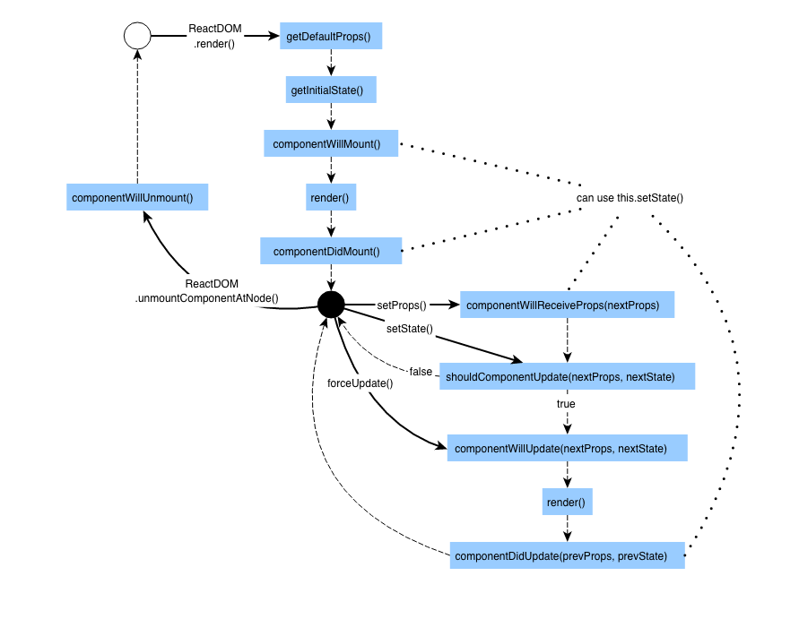

# React
- [component lifecycle](http://dbertella.github.io/react-lifecycle-svg/)
  
- props
- state

Nice to have
- immutable.js
- Server side rendering

## JSX
String refs are bad in quite a few ways:
1. String refs are not composable. A wrapping component can’t “snoop” on a ref to a child if it already has an existing string ref. On the other hand, callback refs don’t have a single owner, so you can always compose them.
2. String refs don’t work with static analysis like Flow. Flow can’t guess the magic that framework does to make the string ref “appear” on `this.refs`, as well as its type (which could be different). Callback refs are friendlier to static analysis.
3. The owner for a string ref is determined by the currently executing component. This means that with a common “render callback” pattern (e.g. `<DataTable renderRow={this.renderRow} />`), the wrong component will own the ref (it will end up on `DataTable` instead of your component defining `renderRow`).
4. String refs force React to keep track of currently executing component. This is problematic because it makes `react` module stateful, and thus causes weird errors when `react` module is duplicated in the bundle.
This is why we want to move away from them in favor of callback refs that solve all those problems.

## ES2015 syntax
```
import React from 'react';

class MyComponent extends React.Component {
  constructor() {
    this.handleClick = this.handleClick.bind(this);
  }
  handleClick = () => {
    console.log('hello world');
  };
  render() {
    return (
      <button onClick={this.handleClick}>Say Hello</button>
    );
  }
}
Contacts.propTypes = {

};
Contacts.defaultProps = {

};

export default MyComponent;
```
## React Router

- Router
  `<Router history={browserHistory}>`
- Route
  `<Route path="/(:filter)" component={App}` />
  () means optional parameter
- Link
  `<Link to={filter} activeStyle={{ textDecoration: 'none' }}`>
  activeStyle prop -> prop to style the active route in Link component

React router > 3.x.x `withRouter`

`withRouter(connect(Component))`: HoC that inject react router props into component (using with redux)

## Hoc
```
import React, { Component } from "React";

export const Enhance = ComposedComponent => class extends Component {
  constructor() {
    this.state = { data: null };
  }
  componentDidMount() {
    this.setState({ data: 'Hello' });
  }
  render() {
    return <ComposedComponent {...this.props} data={this.state.data} />;
  }
};
```

```
import React, { Component } from 'React';

export const Enhance = ComposedComponent => {
  class NewComponent extends Component {
    constructor() {
      this.state = { data: null };
    }
    componentDidMount() {
      this.setState({ data: 'Hello' });
    }
    render() {
      return <ComposedComponent {...this.props} data={this.state.data} />;
    }
  }
  NewComponent.propTypes = {
    // whatever
  };
  return NewComponent;
};
```
http://rea.tech/reactjs-real-world-examples-of-higher-order-components/

## Enzyme [link](http://airbnb.io/enzyme/)
Before react testing the UI it's always been hard.
Testing single components and not the entire UI is the key to simplify the process.

> Pure functions (and thus React components) are much easier to test because they simply return a description for what UI of the component should look like, given some application state, rather than actually mutating the UI and having side-effects. This “description” is known as a “Virtual DOM” and is a tree-like data structure.
[link](https://medium.com/airbnb-engineering/enzyme-javascript-testing-utilities-for-react-a417e5e5090f#.jolxe9mz8)

Enzyme exports three different “modes” to render and test components, **shallow**, **mount**, and **render**. Shallow is the recommended mode to start with since it does a better job of isolating your tests to just a single component. If shallow doesn’t work for your use case (for example, if you are relying on the presence of a real DOM), mount or render likely will.

You can use it with every test library and assertion library. You can use it for unit and integration test.

Shallow rendering:  
`const wrapper = shallow(<Foo />);`

[shallow rendering api](https://github.com/airbnb/enzyme/blob/master/docs/api/shallow.md)
```
it('renders the title', () => {
  const item = {
    title: 'New Item',
    completed: false,
  };
  const wrapper = shallow(<ToDoItem item={item} />);
  expect(wrapper.text()).to.contain(item.title);
});
```

**Enzyme Selectors**  
Enzyme Selectors can find nodes by 4 categories:
- CSS selectors `.class`, `#id`, `tag`, `[prop="text"]`: `wrapper.find('.class')`
- component constructor `wrapper.find(Component)`
- display name `wrapper.find('ComponentDisplayName')`
- object properties `wrapper.find({ prop: text })`

**Event simulations**  
Enzyme gives you a concise and elegant way of simulating user events, one of the trickier aspects of UI testing. Just pass the name of the event you want to simulate, along with any required data:

```
wrapper.simulate('click', {
  stopPropagation() { console.log('Stopped propagation'); }
})
```

**Debug**  
`console.log(wrapper.debug())`

Returns an HTML-like string of the wrapper for debugging purposes. Useful to print out to the console when tests are not passing when you expect them to. A nicely formatted JSX

https://github.com/airbnb/enzyme/blob/master/docs/api/ShallowWrapper/debug.md

## Workshop by nodeschool
https://github.com/kohei-takata/learnyoureact
